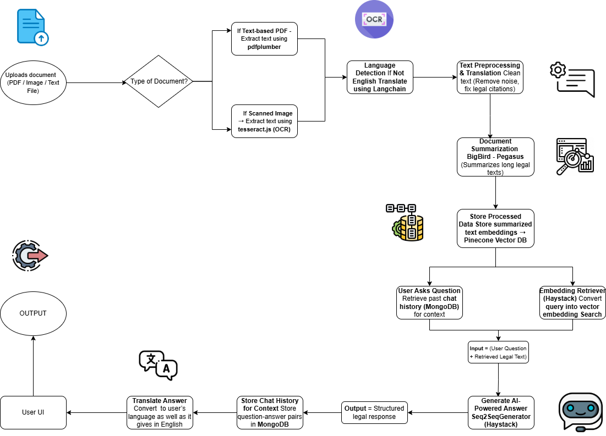
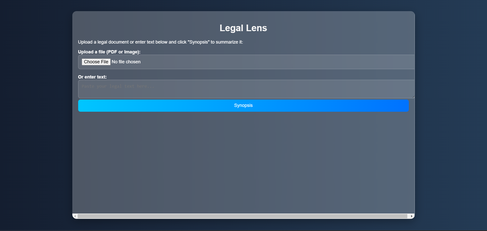
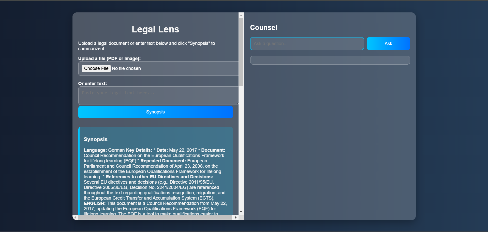
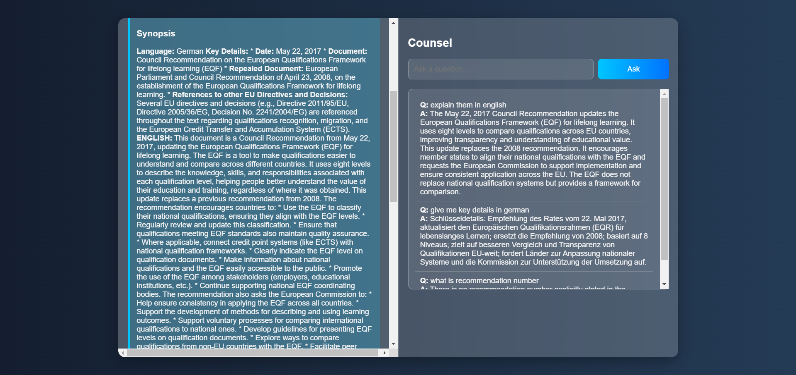

# LegalLens

LegalLens is an AI-powered system that processes, summarizes, and retrieves legal documents, enabling users to quickly understand complex contracts and receive structured responses to their legal queries.

## Overview

LegalLens allows users to upload legal documents (PDFs, images, or text files), extracts text, summarizes it, and stores the information for future retrieval. Users can then ask questions, and the system retrieves relevant sections from the document, generates an AI-powered response, and presents it in the user's preferred language.

## Features

- **Document Upload**: Supports scanned images, PDFs, and text files.
- **OCR Processing**: Uses Tesseract.js for extracting text from images.
- **Translation**: Automatically translates documents and responses.
- **Summarization**: Uses BigBird-Pegasus to create concise legal summaries.
- **Search & Retrieval**: Stores vector embeddings in Pinecone for fast retrieval.
- **AI-Generated Responses**: Provides structured legal answers using NLP models.
- **Multi-Language Support**: Allows users to interact in different languages.
- **Chat History Storage**: Saves conversations in MongoDB for context-aware responses.

## Workflow

### 1️⃣ User Uploads a Legal Document
- **Input**: PDF, Image (Scanned Legal Document), or Text File
- **Processing**:
  - Extracts text using `pdfplumber` (for text-based PDFs) or `tesseract.js` (for scanned images).
  - Detects language and translates to English if needed (`facebook/m2m100`).

### 2️⃣ Text Preprocessing & Translation
- **Cleans extracted text**: Removes special characters, spaces, and formats legal citations.
- **Translates non-English documents** using `facebook/m2m100`.

### 3️⃣ Summarization
- **Uses BigBird-Pegasus** to summarize long documents.
- **Breaks down text** into chunks and summarizes each before merging.

### 4️⃣ Storing Data
- **Embeddings** stored in **Pinecone Vector DB**.
- **Chat history** saved in **MongoDB** for future reference.

### 5️⃣ User Asks a Question
- Checks if the query needs translation (`facebook/m2m100`).
- Retrieves relevant past chat history (`MongoDB`).

### 6️⃣ Retrieving Relevant Text
- Converts query into vector embeddings (`EmbeddingRetriever - Haystack`).
- Searches Pinecone for relevant document sections.

### 7️⃣ AI-Powered Answer Generation
- `Seq2SeqGenerator (Haystack)` processes user query & retrieved text.
- Generates structured legal response.

### 8️⃣ Context Retention & Translation
- Saves chat history for context-aware interactions.
- Translates answer back to user's preferred language (if needed).

### 9️⃣ Final Response Display
- User receives AI-generated structured legal answer.

## Flowchart

## UI Screenshots

### Landing Page

### Summarization UI

### Chat UI

## Tech Stack

### Frontend
- `React.js` or `Vue.js`
- `JavaScript` (for UI interactions)

### Backend
- `Flask` (Python)

### Document Processing
- `pdfplumber` (for text PDFs)
- `tesseract.js` (OCR for images & scanned PDFs)
- `facebook/m2m100` (Language Translation)

### Summarization
- `BigBird-Pegasus` (Summarization Model)
- `RecursiveCharacterTextSplitter` (for chunking)

### Storage & Retrieval
- `Pinecone` (Vector Database for embeddings)
- `MongoDB` (Chat history storage)
- `sentence-transformers/all-mpnet-base-v2` (Embedding Model)

### Query & Answer Generation
- `Haystack` (For retrieval & QA pipeline)
- `EmbeddingRetriever` (Retrieves legal text from Pinecone)
- `Seq2SeqGenerator` (Generates structured answers)

## Future Improvements
- **User Authentication** for personalized legal document management.
- **Improved UI** with interactive contract visualization.
- **Enhanced Legal Reasoning** using fine-tuned LLMs.

